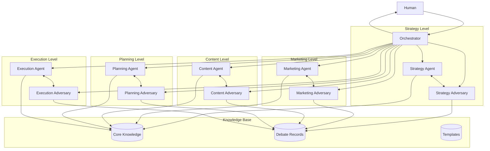
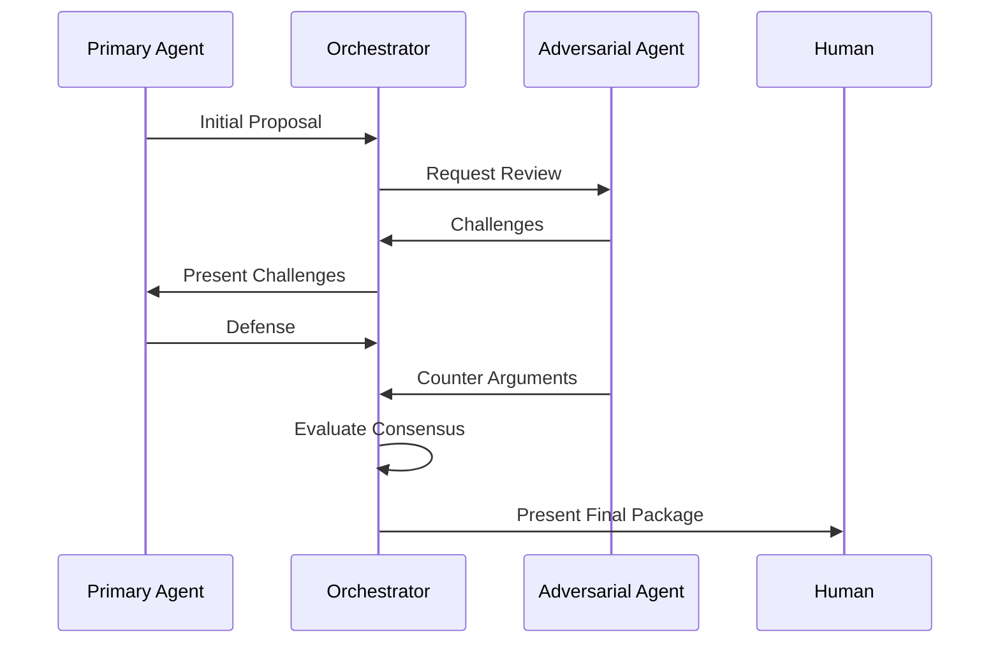

# CrewAI Content Marketing System Design Document

## 1. System Overview

### 1.1 Purpose
To create an automated content marketing system using CrewAI that orchestrates multiple AI agents and their adversarial counterparts to collaborate with humans in developing and executing content marketing strategies.

### 1.2 High-Level Architecture



## 2. Agent Pairs Specifications

### 2.1 Strategy Level
#### Primary Agent (Strategy Analyst)
- **Responsibilities**:
  - Target audience analysis
  - Value proposition development
  - Brand vision articulation
- **Outputs**:
```json
{
  "strategy_analysis": {
    "target_audience": {
      "segments": [],
      "pain_points": [],
      "goals": []
    },
    "value_proposition": {
      "core_benefits": [],
      "unique_factors": [],
      "proof_points": []
    },
    "brand_vision": {
      "mission": "",
      "values": [],
      "goals": []
    }
  }
}
```

#### Adversarial Agent (Market Skeptic)
- **Challenge Areas**:
  - Market assumptions
  - Segment viability
  - Competitive threats
- **Validation Points**:
```json
{
  "challenge_framework": {
    "market_validation": {
      "size_verification": [],
      "growth_potential": [],
      "barrier_analysis": []
    },
    "segment_testing": {
      "accessibility": [],
      "profitability": [],
      "sustainability": []
    }
  }
}
```

[Similar detailed specifications for other agent pairs...]

## 3. Debate Protocol

### 3.1 Process Flow


### 3.2 Debate Rules
1. Evidence-based arguments required
2. Maximum 3 rounds per topic
3. Must propose alternatives
4. Focus on improvement
5. Time-boxed discussions

## 4. System Components

### 4.1 Orchestrator
```python
class Orchestrator:
    def execute_workflow(self):
        for level in self.levels:
            # Initial generation
            proposal = self.primary_agents[level].generate()
            
            # Debate cycle
            for round in range(3):
                challenges = self.adversarial_agents[level].review(proposal)
                if self.consensus_reached(proposal, challenges):
                    break
                    
                defense = self.primary_agents[level].defend(challenges)
                proposal = self.refine_proposal(proposal, defense)
            
            # Human review
            self.prepare_human_review(proposal, challenges, defense)
```

### 4.2 Knowledge Base Structure
```json
{
  "project_data": {
    "id": "",
    "status": "",
    "stage": "",
    "debates": [{
      "round": 0,
      "proposal": {},
      "challenges": [],
      "defense": [],
      "resolution": {}
    }],
    "human_feedback": []
  }
}
```

## 5. Consensus Mechanism

### 5.1 Evaluation Criteria
- Evidence strength (30%)
- Practical feasibility (30%)
- Market impact (20%)
- Resource efficiency (20%)

### 5.2 Resolution Paths
1. Full agreement
2. Conditional approval
3. Hybrid solution
4. Human escalation

## 6. Human Interaction Framework

### 6.1 Review Package Structure
```json
{
  "executive_summary": {
    "key_decisions": [],
    "unresolved_points": [],
    "recommendations": []
  },
  "debate_history": {
    "rounds": [],
    "key_points": [],
    "resolutions": []
  },
  "action_required": {
    "decisions": [],
    "implications": [],
    "timeline": {}
  }
}
```

### 6.2 Feedback Integration
- Immediate application to current project
- Storage for future reference
- Pattern recognition for improvement
- Update to agent knowledge base

## 7. Implementation Guidelines

### 7.1 Technical Requirements
- CrewAI framework
- Database system
- API infrastructure
- User interface

### 7.2 Setup Process
1. Agent initialization
2. Knowledge base setup
3. Debate protocol configuration
4. Human interface setup

## 8. Error Handling

### 8.1 Recovery Procedures
- Agent failure recovery
- Debate deadlock resolution
- Data consistency checks
- State management

### 8.2 Validation Points
- Data completeness
- Format compliance
- Dependency satisfaction
- Quality metrics

## 9. Performance Metrics

### 9.1 System Metrics
- Response times
- Completion rates
- Consensus speed
- Resource utilization

### 9.2 Output Quality
- Proposal strength
- Challenge relevance
- Resolution effectiveness
- Human satisfaction

## 10. Security Considerations

### 10.1 Data Protection
- Encryption
- Access control
- Audit logging
- Privacy compliance

### 10.2 Process Security
- Agent authentication
- Debate integrity
- Output validation
- Version control