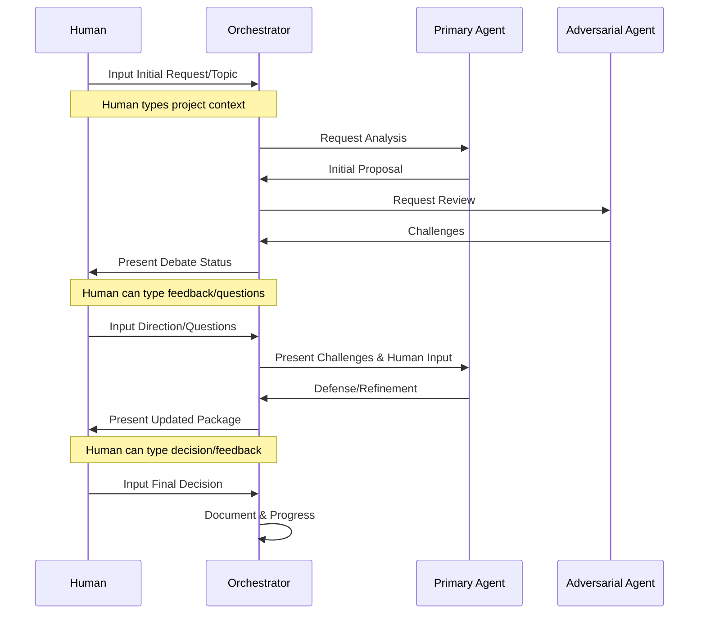

# Debate Protocol

## Overview
The debate protocol defines how humans and AI agents interact through a chat-based interface to develop content marketing strategies following the framework layers.

## Core Principles
1. Human-Centric
   - Humans lead strategic direction
   - AI agents support decision-making
   - Clear human input points
   - Framework-guided discussions

2. Evidence-Based
   - All proposals backed by data
   - Challenges require evidence
   - Clear validation points
   - Traceable decisions

3. Framework-Aligned
   - Layer-specific discussions
   - Progressive development
   - Clear dependencies
   - Quality validation

## Process Flow

## Chat Interface Structure

### 1. Framework Context Display
- Current layer indicator
- Progress through layers
- Required decisions
- Framework criteria

### 2. Message Types
- Primary Agent Proposals
- Adversary Challenges
- Human Text Input/Questions
- System Updates
- Evidence Presentations

### 3. Message Components
- Framework layer tag
- Role identifier
- Content
- Supporting evidence
- Required actions
- Timestamps
- Human Input Field (always available)

### 4. Navigation Features
- Layer filtering
- Evidence expansion
- Decision highlighting
- Context preservation
- Text input history

## Human Interaction Points

### 1. Project Initialization
- Type project description/goals
- Input target audience details
- Specify constraints/requirements
- Set priorities

### 2. Framework Layer Start
- Type layer-specific objectives
- Input known constraints
- Ask questions about layer
- Set expectations

### 3. During Debate
- Ask questions about proposals
- Type feedback on challenges
- Request clarifications
- Provide additional context
- Input specific directions

### 4. Decision Points
- Type detailed feedback
- Input specific changes needed
- Provide approval/rejection reasons
- Ask follow-up questions

### 5. Layer Completion
- Type final feedback
- Input transition requirements
- Specify next layer focus
- Document key learnings

## Agent Interaction Rules

### 1. Primary Agents
- Must provide evidence-based proposals
- Must address human questions
- Must consider framework criteria
- Must document assumptions

### 2. Adversarial Agents
- Must challenge with evidence
- Must propose alternatives
- Must validate assumptions
- Must consider practicality

### 3. Interaction Guidelines
- Maximum 3 rounds per topic
- Evidence required for claims
- Clear alternative proposals
- Focus on improvement
- Time-boxed discussions

## Consensus Mechanism

### 1. Evaluation Criteria
- Evidence strength (30%)
- Practical feasibility (30%)
- Market impact (20%)
- Resource efficiency (20%)

### 2. Resolution Paths
- Full agreement
- Conditional approval
- Hybrid solution
- Human escalation

## Documentation

### 1. Chat History
- Complete message thread
- Evidence attachments
- Decision points
- Framework context

### 2. Decision Records
- Final decisions
- Supporting evidence
- Impact assessment
- Next steps

## Success Metrics

### 1. Process Quality
- Framework alignment
- Evidence quality
- Discussion efficiency
- Decision clarity

### 2. Outcome Quality
- Strategy effectiveness
- Implementation feasibility
- Resource efficiency
- Human satisfaction

## Implementation Notes

### 1. Technical Requirements
- Real-time chat capabilities
- Evidence linking system
- Framework tracking
- History management

### 2. User Experience
- Clear role identification
- Easy navigation
- Context preservation
- Quick actions

### 3. Quality Assurance
- Framework alignment checks
- Evidence validation
- Decision documentation
- Progress tracking
