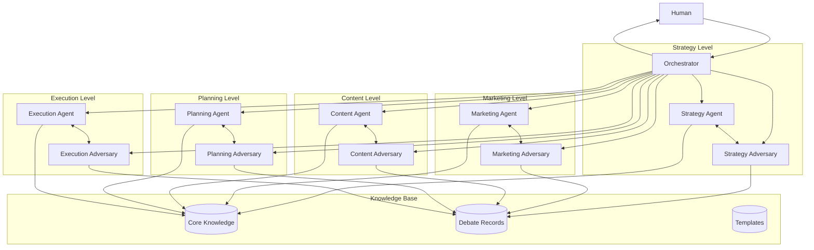

# System Overview

## Purpose
To create an automated content marketing system using CrewAI that orchestrates multiple AI agents and their adversarial counterparts to collaborate with humans in developing and executing content marketing strategies.

## Key Features
1. Framework-Driven Collaboration
   - Follows 80/20 content marketing framework
   - Structured progression through framework layers
   - Clear decision points and documentation
   - Framework alignment validation

2. Human-AI Collaboration
   - Real-time text interaction
   - Framework-guided discussions
   - Evidence-based decision making
   - Continuous feedback loop

3. Multi-Agent Architecture
   - Primary and adversarial agent pairs
   - Layer-specific expertise
   - Structured debate protocol
   - Consensus-driven decisions

## System Architecture

## Core Components

### 1. Orchestrator
- Manages workflow execution
- Coordinates agent interactions
- Handles human input/output
- Maintains system state
- Ensures framework alignment

### 2. Agent Pairs
- Strategy Level: Market analysis and validation
- Marketing Level: Positioning and messaging
- Content Level: Narrative and pillar development
- Planning Level: Channel and format strategy
- Execution Level: Content creation and quality

### 3. Knowledge Base
- Core Knowledge: Framework and domain expertise
- Debate Records: Discussion history and decisions
- Templates: Standardized formats and structures

### 4. Human Interface
- Chat-based interaction
- Framework navigation
- Decision documentation
- Progress tracking
- Evidence review

## Interaction Flow

1. Project Initialization
   - Human provides initial context
   - System sets up framework structure
   - Agents prepare for engagement

2. Layer Progression
   - Framework-guided discussions
   - Agent debates and proposals
   - Human review and decisions
   - Documentation and progress

3. Quality Assurance
   - Framework alignment checks
   - Evidence validation
   - Human approval gates
   - Performance metrics

## Success Metrics

### 1. Process Metrics
- Framework coverage
- Decision quality
- Response times
- Resource efficiency

### 2. Output Metrics
- Content effectiveness
- Strategy alignment
- Human satisfaction
- System reliability

## Next Steps
1. Review detailed agent specifications
2. Explore debate protocol
3. Understand human interface
4. Check implementation plan
