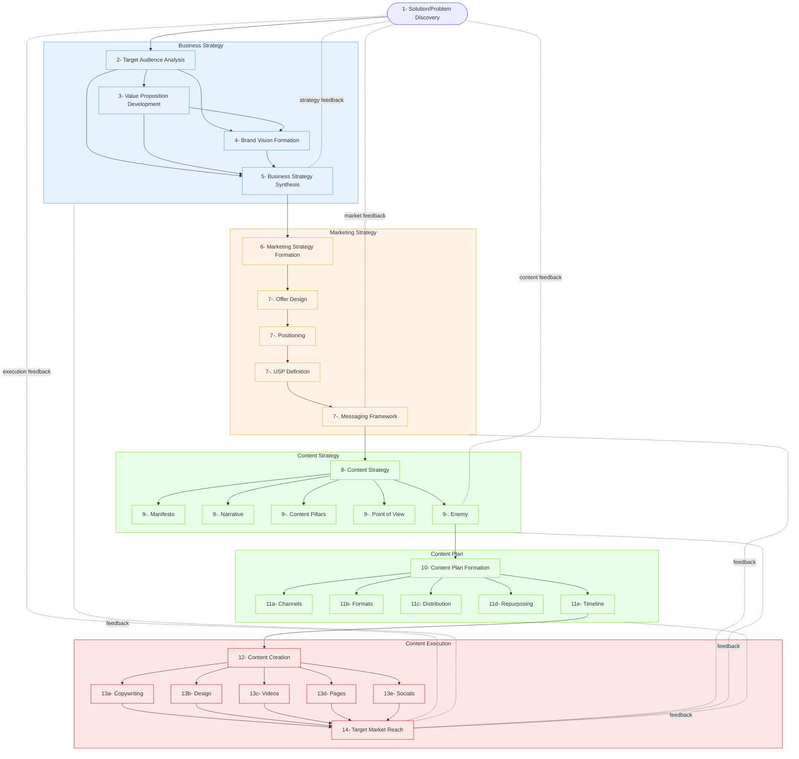

# Content Marketing Framework

## Overview
Content Marketing is 80% of Invisible Decisions - a hierarchical framework showing the strategic layers behind successful content marketing.

## Core Principle
The framework emphasizes that successful content marketing isn't just about creating content - it's about having a comprehensive strategy that aligns with business goals and target audience needs. The visible content (20%) is supported by invisible strategic decisions (80%).

## Framework Diagram

## Framework Layers

### 1. Business Strategy Foundation
#### Target Audience Analysis
Identifying who you're trying to reach. Create detailed buyer personas including:

  - Demographics and psychographics
  - Pain points and challenges
  - Goals and aspirations
  - Preferred communication channels
  - Decision-making factors

#### Value Proposition Development
What unique value you offer. Core value statement addressing:
  - Problem solved
  - Benefits delivered
  - Competitive advantage
  - Success metrics

#### Brand Vision Statement
Your long-term brand direction and goals. Define:
  - 5-year vision
  - Core values
  - Brand personality
  - Market position aspiration

### 2. Marketing Strategy Framework
#### Offer Structure
What you're selling or providing.

- Primary offerings
- Pricing strategy
- Service/product bundles
- Customer journey touchpoints

#### Market Positioning
 How you position yourself in the market

- Competitive analysis
- Market gap identification
- Position statement
- Key differentiators

#### Unique Selling Proposition (USP)
What makes you different

- Primary USP
- Supporting evidence
- Competitive advantages
- Value metrics

#### Messaging Framework
How you communicate your value.

- Key messages by audience segment
- Tone of voice guidelines
- Brand language parameters
- Communication hierarchy

### 3. Content Strategy Blueprint
#### Brand Manifesto
Your core beliefs and principles

- Purpose statement
- Brand beliefs
- Industry stance
- Cultural impact

#### Brand Narrative
The story you tell

- Origin story
- Mission narrative
- Customer success stories
- Future vision

#### Content Pillars
Main themes or topics you focus on

- 3-5 core themes
- Sub-topics for each pillar
- Content mix ratios
- Expert positioning areas

#### Point of View Development
Your unique perspective

- Industry perspective
- Thought leadership areas
- Stance on key issues
- Innovation vision

#### Enemy Identification
What you're fighting against or trying to solve.

- Market problems to solve
- Industry pain points
- Competitive alternatives
- Status quo challenges

### 4. Content Planning System
#### Channel Strategy
Where you'll publish

- Primary channels
- Channel-specific goals
- Performance metrics
- Cross-channel integration

#### Content Formats
Types of content you'll create

- Format types by channel
- Production requirements
- Resource allocation
- Quality standards

#### Distribution Strategy
How you'll share your content

- Publishing calendar
- Promotion tactics
- Amplification methods
- Partnership opportunities

#### Repurposing Matrix
How you'll adapt content for different uses

- Content transformation map
- Cross-channel adaptation
- Update schedule
- Archive strategy

#### Timeline Management
When you'll publish

- Content calendar
- Production deadlines
- Review cycles
- Publication schedule

### 5. Content Creation & Execution
#### Copywriting Guidelines
The actual written content

- Style guide
- Voice and tone
- SEO requirements
- Call-to-action framework

#### Design Standards
- Visual identity guide
- Image guidelines
- Typography rules
- Brand colors

#### Video Production
- Video types
- Production standards
- Platform requirements
- Distribution plan

#### Page Development
- Website architecture
- Landing page templates
- Content organization
- User experience guidelines

#### Social Media Execution
- Platform-specific strategies
- Content types by platform
- Engagement guidelines
- Community management plan

## Success Metrics
- Engagement rates
- Conversion metrics
- Brand awareness
- Lead generation
- ROI measurements

## Framework Success Criteria
1. **Strategic Alignment**
   - All content aligns with business objectives
   - Clear connection between strategy and execution
   - Consistent messaging across channels

2. **Content Effectiveness**
   - Measurable engagement metrics
   - Achievement of conversion goals
   - Brand awareness growth
   - Lead generation success
   - Positive ROI measurements

3. **Process Efficiency**
   - Streamlined content production
   - Effective resource utilization
   - Consistent quality standards
   - Timely content delivery
