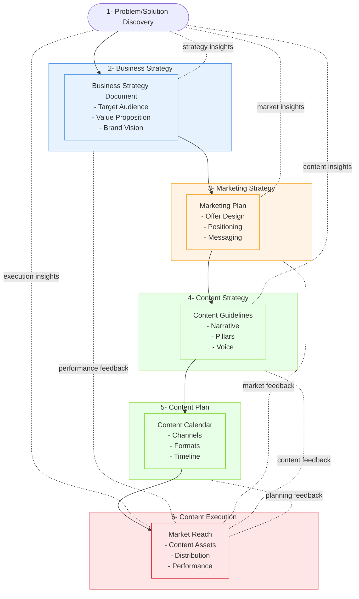

```mermaid
graph TB
    Start([Problem/Solution Discovery])
    
    subgraph BS["2- Business Strategy"]
        BSS[Business Strategy Document<br/>- Target Audience<br/>- Value Proposition<br/>- Brand Vision]
    end
    
    subgraph MS["3- Marketing Strategy"]
        MSF[Marketing Plan<br/>- Offer Design<br/>- Positioning<br/>- Messaging]
    end
    
    subgraph CS["4- Content Strategy"]
        CSF[Content Guidelines<br/>- Narrative<br/>- Pillars<br/>- Voice]
    end
    
    subgraph CPL["5- Content Plan"]
        CPF[Content Calendar<br/>- Channels<br/>- Formats<br/>- Timeline]
    end
    
    subgraph EX["6- Content Execution"]
        TM[Market Reach<br/>- Content Assets<br/>- Distribution<br/>- Performance]
    end
    
    Start --> BSS
    BSS --> MSF
    MSF --> CSF
    CSF --> CPF
    CPF --> TM
    
    %% Feedback Loops
    TM -.-|"performance feedback"| BS
    TM -.-|"market feedback"| MS
    TM -.-|"content feedback"| CS
    TM -.-|"planning feedback"| CPL
    
    %% Strategic Feedback to Discovery
    BSS -.-|"strategy insights"| Start
    MSF -.-|"market insights"| Start
    CSF -.-|"content insights"| Start
    TM -.-|"execution insights"| Start(["1- Problem/Solution Discovery"])
    
    classDef strategy fill:#e6f3ff,stroke:#4a90e2
    classDef marketing fill:#fff3e6,stroke:#f5a623
    classDef content fill:#e6ffe6,stroke:#7ed321
    classDef execution fill:#ffe6e6,stroke:#d0021b
    
    class BS,BSS strategy
    class MS,MSF marketing
    class CS,CSF content
    class CPL,CPF content
    class EX,TM execution
```